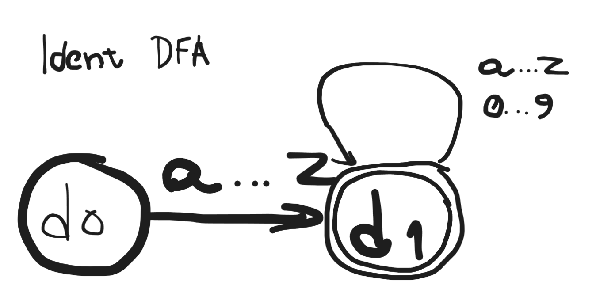

# Ident
(all drawings were done on https://excalidraw.framalab.org/)

identifier is defined by a char from a-z followed by zero or more chars or digits (0–9 or a-z).

- RE : `[a-z][a-z0-9]*`

We only require a DFA to represent Ident, as algorithms such as Thompsons construction and subset construction exist to handle
problems that make it hard to "just draw DFA directly": 
- REs that dont map 1:1 to states (alternations, epsilon, groups)
- overlapping REs across token types (`<=` vs `=` vs `=>`)

ident is straight RE with no alternation or ambiguity, or overlap, except with keywords,
which are going to be handled via post-lookup. 

double circle marks accepting state of a DFA.

# IntLit

Integer literal, same thing as Identifier, identified as a single number 1-9 followed by 
zero or more 0-9 digits, or a single 0.

- RE : `0|[1-9][0-9]*`

# Plus/Minus/Star/slash

4 special chars, each needs separate RE's :
- `+` `-` `*` `/`

# `<=, ==, > , >=` cluster

