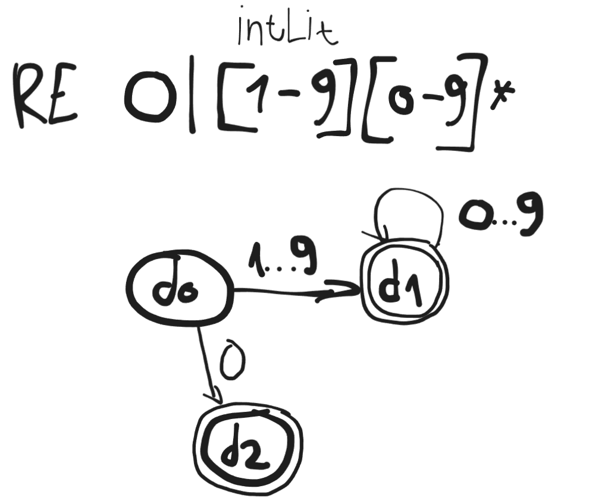
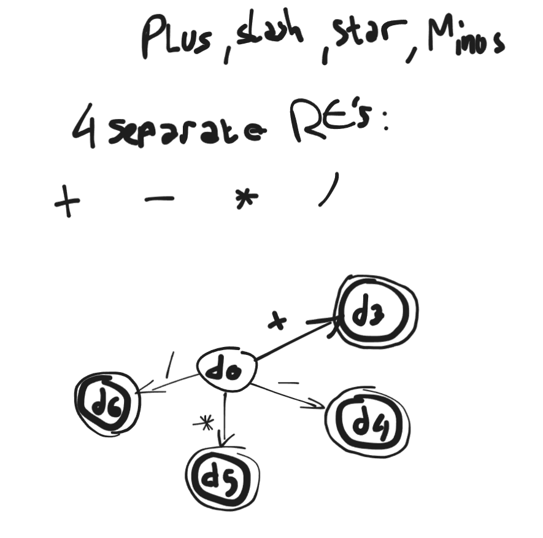
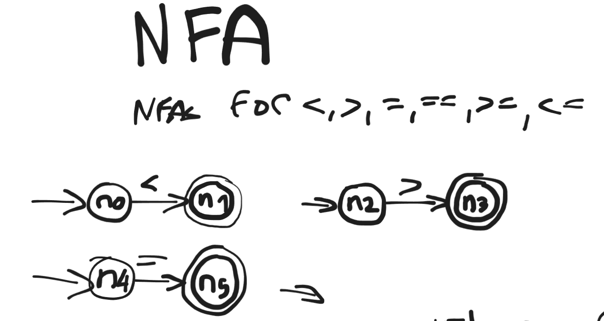
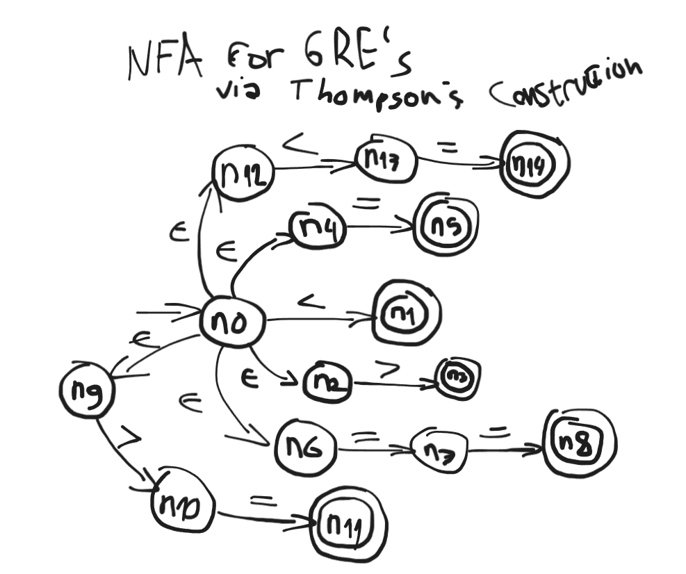
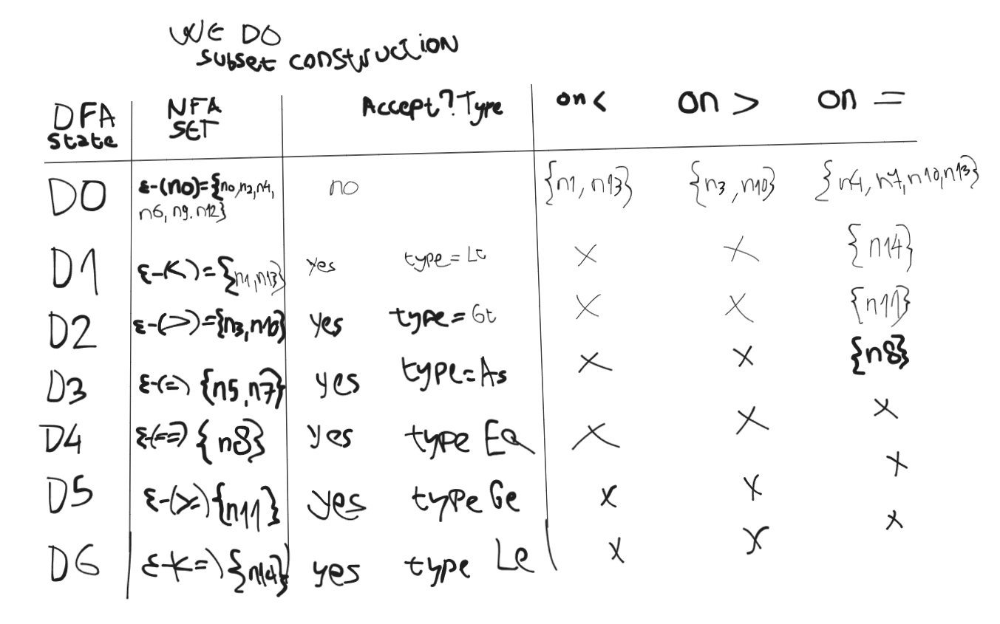
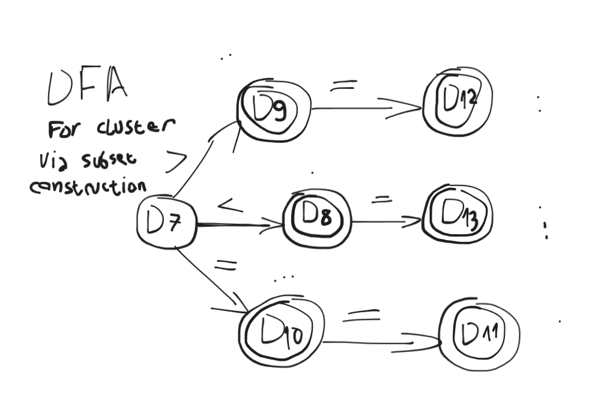

# Ident
(all drawings were done on https://excalidraw.framalab.org/)

identifier is defined by a char from a-z followed by zero or more chars or digits (0–9 or a-z).

- RE : `[a-z][a-z0-9]*`

We only require a DFA to represent Ident, as algorithms such as Thompsons construction and subset construction exist to handle
problems that make it hard to "just draw DFA directly": 
- REs that dont map 1:1 to states (alternations, epsilon, groups)
- overlapping REs across token types (`<=` vs `=` vs `=>`)

ident is straight RE with no alternation or ambiguity, or overlap, except with keywords,
which are going to be handled via post-lookup. 

double circle marks accepting state of a DFA.

# IntLit

Integer literal, the same thing as Identifier, identified as a single digit 1-9 followed by 
zero or more digits 0-9, or a single 0.

- RE : `0|[1-9][0-9]*`

# Plus/Minus/Star/slash

4 special chars, each needs separate RE's :
- `+` `-` `*` `/`

# `<, =, <=, ==, > , >=` cluster

For < > == = <= >=, an RE isn't enough on its own 
several of these tokens share a prefix (< is a prefix of <=, = is a prefix of ==),
so building the DFA directly by hand risks merging or misordering states incorrectly.
This cluster is where Thompson's construction and subset construction actually earn their keep, unlike the single-character operators or Ident/IntLit, which are simple enough to reason to a DFA directly.

Each token gets its own independent NFA branch off a shared start state 
(via epsilon transitions), keeping its own accept state distinct even where paths overlap.

Subset construction then merges these into one DFA,
correctly resolving the overlap: reading < alone lands in an accepting state for Lt,
but that same state has an outgoing transition on = into a further accepting state for Le
, the DFA below shows exactly how that merge falls out.

After this, we got all the DFA's we need to continue with scanner table generation.